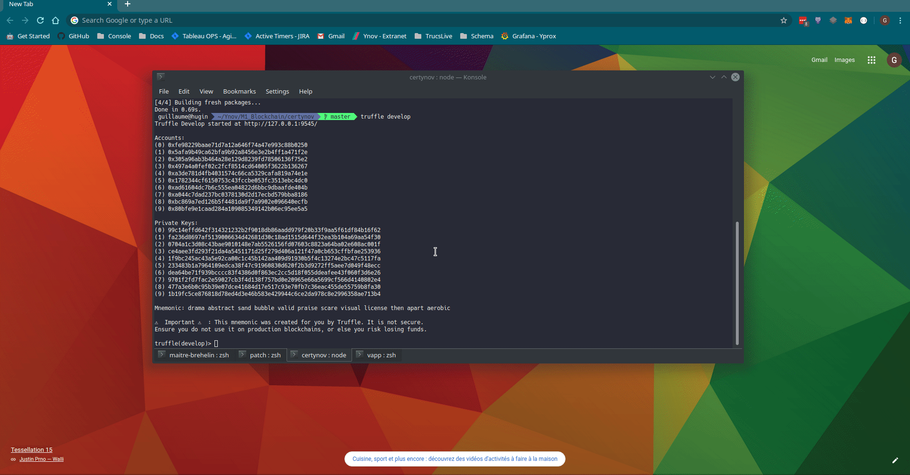
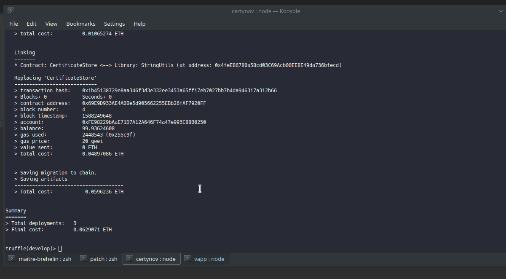

# Ynov - M1 Elective Blockchain

## Projet : certynov

### Development environment setup:

##### open a shell and type
```bash
git clone https://github.com/certynov/certynov

cd certynov

yarn
truffle develop
```

output should look like:

```
Truffle Develop started at http://127.0.0.1:9545/

Accounts:
(0) 0x2946c3ea630d45b29f187005171d7b6997568193
(1) 0xb408e8508cdb7173c925059df21aa16a82ae76a6
(2) 0x4ad176c5971c1712433b9ff3b32e6de1c94def92
(3) 0x192e4229a4d5813313394c87313fe5bb254a9c10
(4) 0x7ee600a11356b1762ee0bc47047f7725e4cd81e7
(5) 0x26fb3b4466d08fdc8603ef9704ff90099dcb6b52
(6) 0xd681bedff90c2590d923b9a7c9000604e137fbfd
(7) 0x74eaa5ad363cc1477e0500189becac378def95c3
(8) 0xa8b9a3d18e71a41c31f1d62e777dce35bade28f9
(9) 0x6d35297cd31d62682f0150af09fd087df86e2d3e

Private Keys:
(0) b29a25dd6526896aaabe5ad89377751acecd594ce8d8b576d3568d20a95d3fd8
(1) f07b4741d1f3c2eba49246a919bf7af333acea45e57fae67b704b5a7f6236171
(2) 925fd5c63d2c8291f439c18a601d2b1b34a95f24bf88a3570229c914cc7cf7fc
(3) f2b8f7e9596fa5ef587c21c07b8c4b7eb97c7e99713f32f4b0c0b89fa751c9ad
(4) ddb2a7392bb20193b70df9b299fed3d69f8157dfe415936a8650c46cace0e28c
(5) b6fc16146c2bf7070ef0c7dd70460471c05ba6c1b97ea214a17de91e970e0688
(6) c3143bf01a9e86c950eac330baccb6dbe1c26edca746ce338f998b485d8ff11d
(7) f10b606a6a2f3e7bc86d15300d8a161b27b36bad99503efb2c463241c87514c1
(8) 374549ac3b8e1151b9b12be7d51bedfa13120f18b794bb753c17cec89f53ee19
(9) 4fed2af9f9b4aa80ec9fd82f42b9109ccb529efdf2d231eea2d416304029d761

Mnemonic: behave minor cash crazy check master junk turtle inch snap other during

⚠️  Important ⚠️  : This mnemonic was created for you by Truffle. It is not secure.
Ensure you do not use it on production blockchains, or else you risk losing funds.
```

###### Note the url at the top of the output, it will be used to setup new Metamask network

##### then in another shell

```bash
cd certynov/vapp

yarn
yarn serve
``` 

you can now access application at `http://localhost:8080`.
Dont forget to setup your MetaMask network and account with one of the key given in truffle develop output

You can install the `Vue devtool` plugin for [Chrome](https://chrome.google.com/webstore/detail/vuejs-devtools/nhdogjmejiglipccpnnnanhbledajbpd) or [Firefox](https://addons.mozilla.org/fr/firefox/addon/vue-js-devtools/) to debug `Vuex` store, state and other.
###### Press `F12` and go to `Vue` tabs

### Recap




